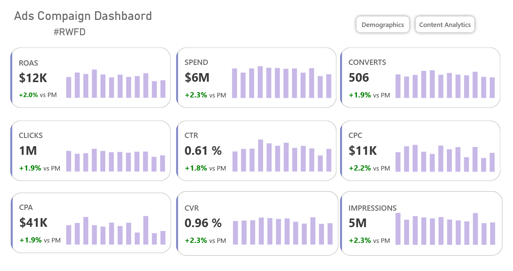
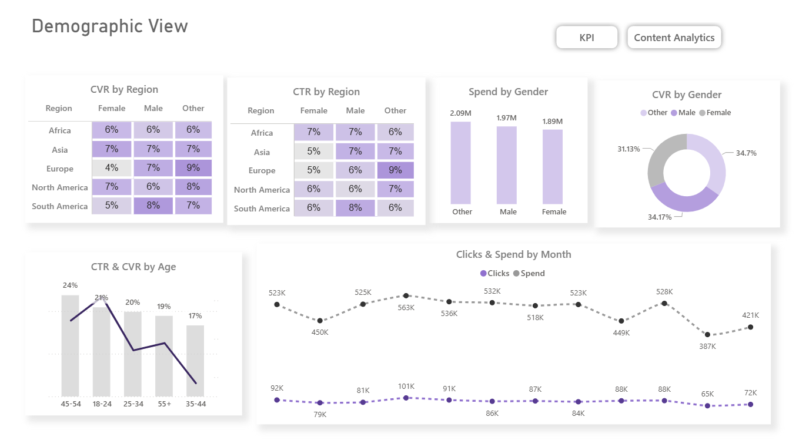
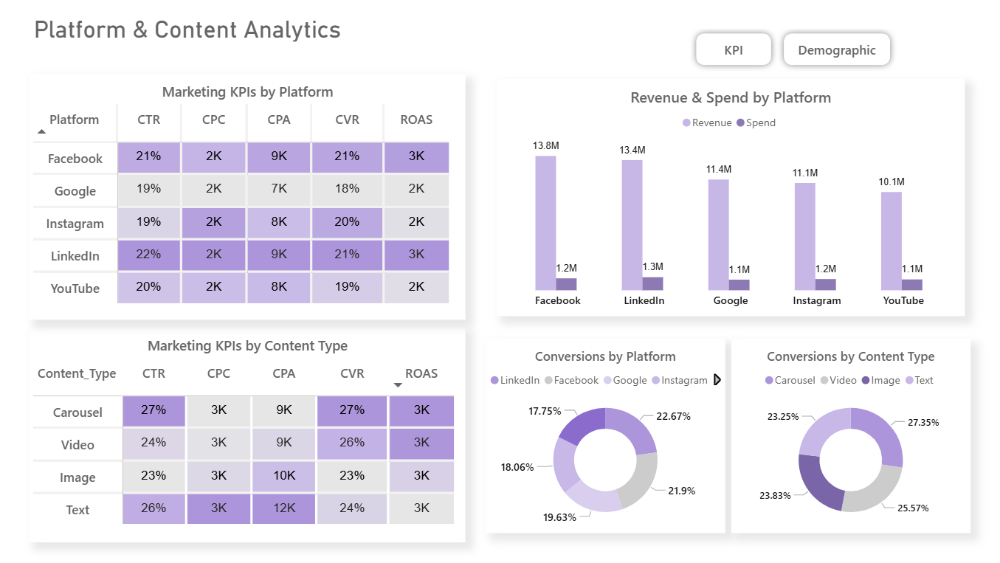

# Compaign Performance Dashboard – PowerBI Project

This project showcases a complete **Marketing Analytics Dashboard** built in **Power BI**, designed to visualize digital advertising performance across demographics, platforms, and content strategies.  
The dataset contains KPIs such as **Clicks, CPC, CTR, Conversions, ROAS, Revenue, Impressions, Spend, and Demographics.**

---

## **Objective**

To provide marketing stakeholders with **data-driven insights** for:

- Campaign performance
- Audience behavior & conversion potential
- Platform & content optimization

---

## **Key Features**

### **Audience & Demographics Dashboard**

Analyzes user behavior based on:

- **Age Groups**
- **Gender**
- **Regions**

Includes KPIs:

- **CVR by Region**
- **CTR by Region**
- **Spend by Gender**
- **CVR by Gender**
- **CVR & CTR by Age**
- **Click & Spend by Month**

---

### **Platform & Content Analytics Dashboard**

Compares performance from:

- **Platforms such as Facebook/Instagram/Google/LinkedIn/Youtube**
- **Content type such as Carousel/Video/Image/Text**

KPIs:

- **Marketing KPIs by Platform & Content type**
- **Revenue & Spend by platform**
- **Conversions by content type**
- **Conversions by platform**

## Publish Link

- Tableau Public: https://app.powerbi.com/groups/me/reports/2826effc-db43-44a3-9ca6-750de2d1c24c/5086cd5e793d83b5274c?experience=power-bi

## Contact

Developed by Rufaida Shafiq
Email: rufaidashafik@gmail.com
GitHub: https://github.com/Rufaidaaa
